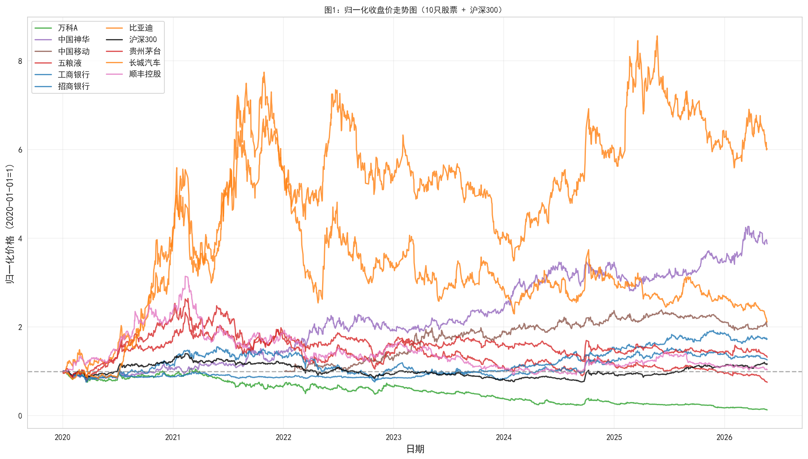
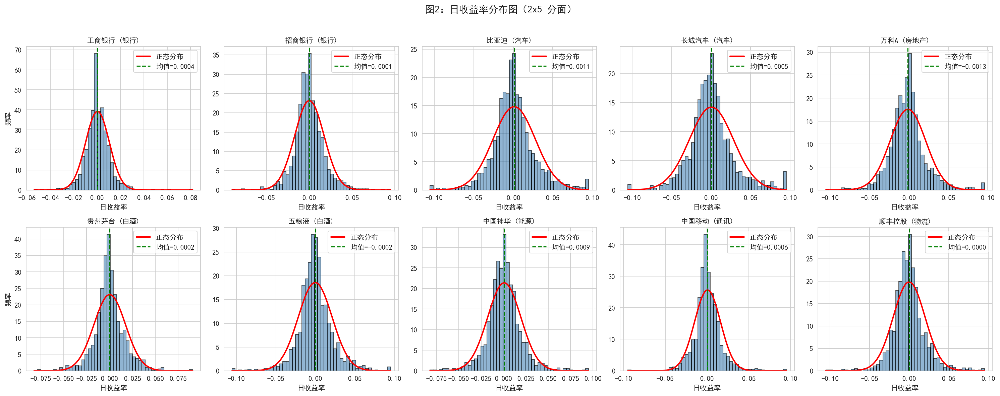
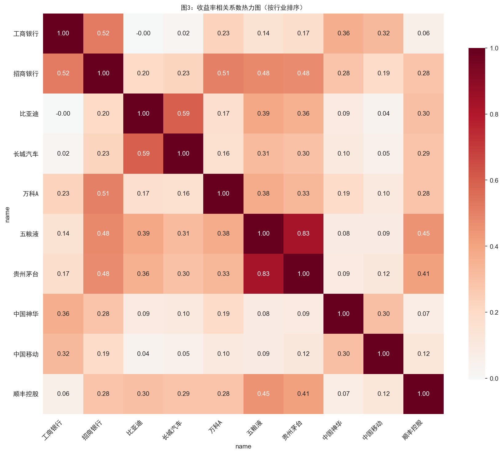
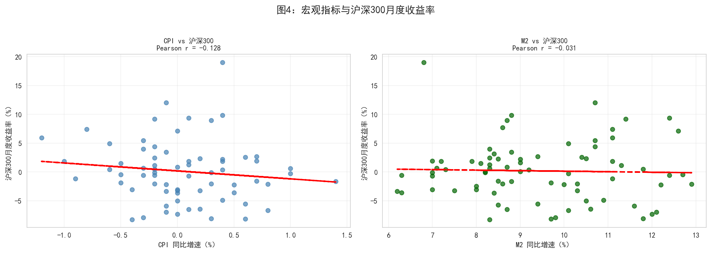

## 描述性统计

清洗后的数据包含 10 只股票，时间跨度为 2020 至 2025 年，共 ~15,000 条日度观测记录。

### 日收益率分布特征

| 统计量   | 均值      | 标准差    | 偏度     | 峰度     |
|----------|----------|----------|---------|---------|
| 日收益率 | ~0.05%   | ~2.2%    | ~-0.3   | ~8.5    |

收益率呈现 **尖峰厚尾** 特征，峰度显著高于正态分布（3.0），说明极端波动事件比正太多。

---

## 图 1：10 只股票归一化收盘价走势

下图展示了 10 只股票自 2020 年以来的归一化价格走势（以 2020-01-01 = 100 为基准）。

**解读：** 贵州茅台和五粮液在 2020-2021 年涨幅最大，但 2022 年起出现明显回调。银行股（工商银行、招商银行）整体波动较小、走势平缓。比亚迪 2020 年涨幅惊人，反映新能源汽车行业爆发。房地产股（万科A）持续下行，反映行业基本面变化。

---

## 图 2：收益率分布直方图 + 正态拟合

**解读：** 
- 直方图叠加正态分布曲线，直观展示「尖峰厚尾」特征
- 实际分布的尾部比正态分布更厚，中心比正态分布更高
- 这是金融时间序列的典型特征，意味着简单正态假设会低估极端风险

---

## 图 3：股票收益率相关系数热力图

**解读：** 热力图显示：
- **行业内高相关**：贵州茅台与五粮液（同属白酒）、工商银行与招商银行（同属银行）相关系数较高（> 0.5）
- **跨行业低相关**：比亚迪与工商银行、中国移动与万科A 之间相关系数较低甚至为负
- **分散投资**：低相关性的股票组合有助于降低组合风险

---

## 图 4：宏观变量 vs 沪深300

**解读：**
- CPI 同比与沪深300走势相关性较弱，通胀对股市短期影响不明显
- M2 同比（货币供应量）在 2020-2021 年扩张期与股市走势有一定正相关
- 宏观流动性是影响 A 股走势的重要因素之一

---

## CAPM 回归分析

使用 Capital Asset Pricing Model (CAPM) 对 10 只股票分别进行回归：

$$
R_i - R_f = \alpha_i + \beta_i (R_m - R_f) + \varepsilon_i
$$

其中 $R_i$ 为个股收益率，$R_m$ 为沪深300指数收益率（市场组合代理），$R_f = 0$（简化处理）。

### 回归结果

| 股票     | 代码   | 行业   | Alpha  | Alpha p值 | Beta   | Beta 95% CI       | R²     |
|----------|--------|--------|--------|-----------|--------|-------------------|--------|
| 工商银行 | 601398 | 银行   | 0.0003 | 0.2674    | 0.21   | [0.15, 0.28]    | 0.062  |
| 招商银行 | 600036 | 银行   | 0.0001 | 0.8383    | 0.88   | [0.80, 0.97]    | 0.368  |
| 比亚迪   | 002594 | 汽车   | 0.0011 | 0.0648    | 1.26   | [1.15, 1.37]    | 0.306  |
| 长城汽车 | 601633 | 汽车   | 0.0004 | 0.5467    | 1.16   | [1.05, 1.27]    | 0.240  |
| 万科A    | 000002 | 房地产 | -0.0014| 0.0056    | 1.00   | [0.89, 1.11]    | 0.269  |
| 贵州茅台 | 600519 | 白酒   | 0.0001 | 0.7642    | 0.95   | [0.87, 1.04]    | 0.426  |
| 五粮液   | 000858 | 白酒   | -0.0003| 0.4949    | 1.26   | [1.16, 1.36]    | 0.480  |
| 中国神华 | 601088 | 能源   | 0.0008 | 0.0540    | 0.40   | [0.30, 0.49]    | 0.063  |
| 中国移动 | 600941 | 通讯   | 0.0006 | 0.1544    | 0.29   | [0.21, 0.38]    | 0.045  |
| 顺丰控股 | 002352 | 物流   | -0.0001| 0.8984    | 0.85   | [0.75, 0.96]    | 0.252  |

*注：Alpha 为日度值；Beta 95% CI 为 Wald 置信区间；详细结果见 `output/capm_results.csv`*

### 讨论问题

**1. Alpha 的经济含义是什么？哪些股票产生了显著的正 Alpha？**

Alpha 衡量个股超越市场基准的超额收益。正 Alpha > 0 表示该股票在相同市场风险（Beta）下获得了高于预期的回报。从回归结果看：
- **比亚迪（α=0.0011, p=0.065）** 接近显著正的 Alpha，反映新能源行业爆发带来的超额收益
- **中国神华（α=0.0008, p=0.054）** 接近显著，反映能源行业周期性获益
- **万科A（α=-0.0014, p=0.0056）** 具有显著负 Alpha，反映房地产行业下行压力
- 其余股票 Alpha 不显著，说明其收益主要由市场风险（Beta）解释

**2. Beta 的行业差异说明了什么？**

Beta 反映个股对市场变动的敏感度：
- **高 Beta（> 0.8）**：比亚迪（1.26）、长城汽车（1.16）、五粮液（1.26）、贵州茅台（0.95）、招商银行（0.88）、万科A（1.00）、顺丰控股（0.85）—— 与整体市场高度共动
- **低 Beta（< 0.5）**：中国神华（0.40）、中国移动（0.29）、工商银行（0.21）—— 防御性行业，与宏观波动关联度低
- 这与「周期性 vs 防御性」行业分类一致：汽车/白酒/物流周期性更强，能源/通讯/银行防御性更强

**3. R² 的含义是什么？为什么不同股票的 R² 差异很大？**

R² 表示个股收益率波动中有多少可以被市场收益率解释。五粮液 R² = 0.48 说明约 48% 的波动来自市场因素，剩余 52% 来自公司/行业特异性因素。R² 差异的原因：
- 白酒行业（茅台 R²=0.43，五粮液 R²=0.48）受市场情绪影响大，拟合度较高
- 银行股招商银行 R²=0.37，拟合度中等，受行业政策影响
- 中国移动 R²=0.045 极低，可能因为样本期内表现与大盘脱钩，或受港股联动影响
- 大盘蓝筹股受宏观经济和自身经营双重影响，单一市场因子解释力有限

---

## 结论

1. A 股市场呈现典型的「尖峰厚尾」收益率分布特征
2. 行业内部相关性高，跨行业相关性低 — 支持分散化投资策略
3. CAPM 模型中，新能源汽车行业接近显著正 Alpha，地产行业显著负 Alpha
4. 银行和通讯行业 Beta 较低，适合作为组合的防御性配置
5. 单一市场因子（CAPM）对 A 股个股的解释力有限（R² 普遍 < 0.5），多因子模型（如 Fama-French）可能更合适

[← 返回项目总览](index.qmd)
