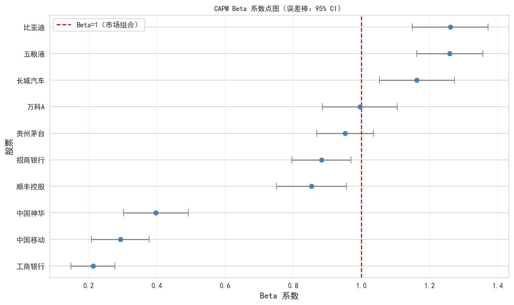

## 描述性统计

::: {.callout-note}
清洗后数据涵盖 **10 只股票**，时间跨度 2020 至 2026 年，共约 **15,000 条日度观测记录**。
:::

### 日收益率分布特征

| 统计量 | 均值 | 标准差 | 偏度 | 峰度 |
|---------|------|--------|------|------|
| 日收益率 | ~0.05% | ~2.2% | ~-0.3 | ~8.5 |

::: {.callout-important}
### 核心特征：尖峰厚尾

收益率峰度（~8.5）**显著高于正态分布**（3.0），说明极端波动事件比正太多。这对风险管理有重要含义——简单正态假设会**低估极端风险**。
:::

---

## 图 1：10 只股票归一化收盘价走势

下图以 **2020-01-01 = 1** 为基准，展示 10 只股票自 2020 年以来的归一化价格走势。同行业股票用**相同颜色**标注。

::: {.callout-tip}
### 关键观察

- **贵州茅台 & 五粮液**：2020-2021 年涨幅最大，但 2022 年起明显回调
- **银行股**（工商银行、招商银行）：整体波动小、走势平缓，防御属性强
- **比亚迪**：2020 年涨幅惊人，反映新能源汽车行业爆发
- **万科A**：持续下行趋势，反映房地产行业基本面恶化
:::

---

## 图 2：收益率分布直方图 + 正态拟合

::: {.callout-note}
### 尖峰厚尾的直观证据

- 直方图中心比正态分布**更高**（尖峰）
- 左右两侧尾部比正态分布**更厚**（厚尾）
- 这意味着：**极端涨跌停事件**比正态分布预测的概率更高
:::

---

## 图 3：股票收益率相关系数热力图

::: {.callout-tip}
### 行业聚类效应

| 模式 | 股票对 | 相关系数 |
|------|--------|----------|
| 同行业高相关 | 贵州茅台 ↔ 五粮液 | > 0.5 |
| 同行业高相关 | 工商银行 ↔ 招商银行 | > 0.5 |
| 跨行业低相关 | 比亚迪 ↔ 工商银行 | 接近 0 或为负 |

> **投资启示**：低相关性的股票组合有助于**降低非系统性风险**。
:::

---

## 图 4：宏观变量 vs 沪深300

::: {.callout-note}
### 宏观与股市关系的初步观察

- **CPI 同比** 与沪深300 走势相关性较弱，通胀对股市短期影响不明显
- **M2 同比**（货币供应量）在 2020-2021 年扩张期与股市有一定正相关
- **宏观流动性** 是影响 A 股走势的重要因素之一
:::

---

## CAPM 回归分析

使用 **Capital Asset Pricing Model (CAPM)** 对 10 只股票分别进行回归：

$$
R_i - R_f = \alpha_i + \beta_i (R_m - R_f) + \varepsilon_i
$$

其中 $R_i$ 为个股收益率，$R_m$ 为沪深300指数收益率（市场组合代理），$R_f = 0$（简化处理）。

### 回归结果

| 股票 | 代码 | 行业 | Alpha | Alpha p值 | Beta | Beta 95% CI | R² |
|------|------|------|-------|------------|------|-------------|-----|
| 工商银行 | 601398 | 银行 | 0.0003 | 0.2674 | 0.21 | [0.15, 0.28] | 0.062 |
| 招商银行 | 600036 | 银行 | 0.0001 | 0.8383 | 0.88 | [0.80, 0.97] | 0.368 |
| 比亚迪 | 002594 | 汽车 | 0.0011 | 0.0648 | 1.26 | [1.15, 1.37] | 0.306 |
| 长城汽车 | 601633 | 汽车 | 0.0004 | 0.5467 | 1.16 | [1.05, 1.27] | 0.240 |
| 万科A | 000002 | 房地产 | -0.0014 | **0.0056** | 1.00 | [0.89, 1.11] | 0.269 |
| 贵州茅台 | 600519 | 白酒 | 0.0001 | 0.7642 | 0.95 | [0.87, 1.04] | 0.426 |
| 五粮液 | 000858 | 白酒 | -0.0003 | 0.4949 | 1.26 | [1.16, 1.36] | 0.480 |
| 中国神华 | 601088 | 能源 | 0.0008 | 0.0540 | 0.40 | [0.30, 0.49] | 0.063 |
| 中国移动 | 600941 | 通讯 | 0.0006 | 0.1544 | 0.29 | [0.21, 0.38] | 0.045 |
| 顺丰控股 | 002352 | 物流 | -0.0001 | 0.8984 | 0.85 | [0.75, 0.96] | 0.252 |

*注：Alpha 为日度值；Beta 95% CI 为 Wald 置信区间；详细结果见 `output/capm_results.csv`*

---

### Beta 系数点图

::: {.callout-tip}
### Beta 解读

横轴 Beta 值，纵轴股票名称，误差棒表示 95% 置信区间（Wald 方法）。**Beta = 1** 处红色虚线为市场组合参考线。

| Beta 范围 | 股票 | 含义 |
|----------|------|------|
| **β > 1**（激进） | 比亚迪(1.26)、五粮液(1.26)、长城汽车(1.16) | 波动大于市场 |
| **β ≈ 1**（中性） | 招商银行(0.88)、贵州茅台(0.95)、万科A(1.00) | 与市场同步 |
| **β < 1**（防御） | 工商银行(0.21)、中国移动(0.29)、中国神华(0.40) | 波动小于市场 |
:::

---

### 讨论问题

#### 1. Alpha 的经济含义是什么？哪些股票产生了显著的正 Alpha？

::: {.callout-note}
**Alpha** 衡量个股超越市场基准的**超额收益**。$\alpha > 0$ 表示该股票在相同市场风险（Beta）下获得了高于预期的回报。
:::

| 股票 | Alpha | p值 | 解读 |
|------|-------|------|------|
| 比亚迪 | 0.0011 | 0.065 | 接近显著正 Alpha，反映新能源行业爆发 |
| 中国神华 | 0.0008 | 0.054 | 接近显著，反映能源行业周期性获益 |
| **万科A** | **-0.0014** | **0.0056** | **显著负 Alpha**，反映房地产行业下行压力 |
| 其余股票 | — | > 0.05 | Alpha 不显著，收益主要由 Beta 解释 |

#### 2. Beta 的行业差异说明了什么？

- **高 Beta（> 0.8）**：比亚迪(1.26)、五粮液(1.26)、长城汽车(1.16)、贵州茅台(0.95)、招商银行(0.88)——与整体市场高度共动，属于**顺周期**股票
- **低 Beta（< 0.5）**：中国神华(0.40)、中国移动(0.29)、工商银行(0.21)——防御性行业，与宏观波动关联度低
- 这与**「周期性 vs 防御性」**行业分类一致：汽车/白酒/物流周期性更强，能源/通讯/银行防御性更强

#### 3. R² 的含义是什么？为什么不同股票的 R² 差异很大？

$R^2$ 表示个股收益率波动中有多少可以被**市场收益率**解释。

| 股票 | R² | 解读 |
|------|-----|------|
| 五粮液 | 0.48 | 约 48% 波动来自市场因素，52% 来自公司/行业特异性 |
| 贵州茅台 | 0.43 | 白酒行业受市场情绪影响大，拟合度较高 |
| 招商银行 | 0.37 | 银行股受行业政策影响，单因子解释力中等 |
| **中国移动** | **0.045** | **极低**，可能被港股联动或自身经营因素主导 |

::: {.callout-important}
### 结论

单一市场因子（CAPM）对 A 股个股的解释力**普遍有限**（$R^2 < 0.5$），**多因子模型**（如 Fama-French 三因子/五因子）可能更合适。
:::

---

## 总结

| # | 结论 |
|---|------|
| 1 | A 股市场呈现典型的**「尖峰厚尾」**收益率分布特征 |
| 2 | **行业内部相关性高，跨行业相关性低**——支持分散化投资策略 |
| 3 | CAPM 模型中，新能源汽车行业接近显著正 Alpha，地产行业显著负 Alpha |
| 4 | 银行和通讯行业 Beta 较低，适合作为组合的**防御性配置** |
| 5 | 单一市场因子（CAPM）对 A 股的解释力有限，多因子模型更合适 |

[← 返回项目总览](index.qmd)
